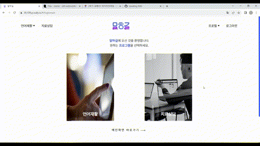

# 말하길 🗣
### 구음장애인의 언어재활을 돕는 웹 서비스
Web services to help people with speech impairment rehabilitation

<br>

## Team 👨‍👩‍👦‍👦
<table align="center">
    <tr align="center">
        <td><a href="https://github.com/skufmid">
            <br />
            <sub><b>전종헌</b></sub></a>
            <br/> Leader / AI 💻
        </td>
        <td ><a href="https://github.com/gunhoo">
            <br />
            <sub><b>박건후</b></sub></a>  
            <br /> BE & EC2 💻
        </td>
        <td><a href="https://github.com/parkeg1223">
            <br />
            <sub><b>박은규</b></sub></a>
            <br /> BE & AI💻
        </td>
        <td><a href="https://github.com/parkeg1223">
            <br />
            <sub><b>오연주</b></sub></a>
            <br />FE & UI/UX 💻
        </td>
        <td><a href="https://github.com/ji-hyon">
            <br />
            <sub><b>서지현</b></sub></a>
            <br /> FE & CI/CD 💻
        </td>
    </tr>
</table>

<br>

## 개요 📁
``` 
본 프로젝트는 뇌졸중과 그 후유증으로 고통받는 사람들을 위한 사회공헌 프로젝트이다. 

‘말하길’은 환자가 잘 말할 수 있기를 바란다는 의미와, 환자가 잘 말할 수 있게 인도해주는 길이라는 두가지를 의미한다. 언어 훈련과 치료 상담 기능을 제공한다. 언어 훈련은 인공지능을 통한 언어 훈련 프로그램을 제공하여 환자들의 언어 능력을 개선을 유도한다. 화상 상담은 환자와 상담사를 매칭하여 화상 상담을 받을 수 있도록 한다. 비대면 웹 서비스를 통해 환자들의 접근성을 향상시켰다.

본 서비스를 통해 실제 치료 효과를 볼 수 있도록 '국민건강보험', '심뇌혈관질환관리중앙지원단'에서 제공하는 치료 방법을 적용하였고, 20명 이상의 신경과, 재활의학과, 언어치료학과 현직 교수들의 자문을 통해 서비스를 개선하는 등 전문성을 갖추기 위해 노력하였다. 또한, 일반 시중 음성인식 인공지능 모델과는 달리, 구음장애인 발화데이터를 기반으로하는 별도의 인공지능 모델을 설계/학습하여 구음장애 발음의 인식률을 개선하였다.
```

<br>

## 개발 기간 Duration 📅

2023.07.04. - 2023.08.18. (7 weeks)

<br>

## 주요 기능 Main Function 🧰


### 언어재활 - 발음


- 음절 / 단어 / 문장 말하기를 연습할 수 있다.
- 아나운서가 발음하는 영상을 확인할 수 있다.
- 발화하는 자신의 모습을 확인할 수 있다.
- 맞게 발음하였는지 정답 여부를 알려주고, 즐겨찾기에 등록할 수 있다.
- AI Model : Powered by [OpenAI Whisper v.20230314](https://openai.com/research/whisper)

### 언어재활 - 인지


- 문제가 제시되고, 해당하는 사물을 고르면 정답 유무를 알려준다.


- 단어와 사진이 제시되면, 보기 중에서 선택하여 정답을 녹음한다.
- 알맞게 발음하였는지 정답 유무를 확인할 수 있다.
- AI Model : From [Kospeech](https://github.com/sooftware/kospeech) & Trained by [Google Colab](https://colab.google/)
- Data set : Collected from [AI Hub](https://aihub.or.kr/aihubdata/data/view.do?currMenu=115&topMenu=100&aihubDataSe=realm&dataSetSn=608)


### 치료상담


- 전체 상담사 목록을 확인할 수 있습니다.
- 조건 검색으로 세부 검색을 할 수 있습니다.


- 원하는 상담사를 선택한 후 상담사가 상담 가능한 시간에 상담 예약 신청이 가능합니다.
- 상담사 승인 상태를 마이페이지에서 확인할 수 있습니다.


- 승인된 상담은 예약 시간 10분 전 상담방에 입장할 수 있습니다.
- 상담사와 1:1 화상상담이 가능합니다.

### 회원


- 이메일 인증을 통해 회원가입을 할 수 있습니다.


- 네이버 로그인을 통해 로그인을 할 수 있습니다.


- 유저 정보를 업데이트 할 수 있습니다.
- 예정된 상담 내역을 확인할 수 있습니다.
- 예정된 상담 내역에서 화상상담에 참여할 수 있습니다.
- 지난 상담을 확인할 수 있습니다.
- 지난 상담사와 재예약을 할 수 있습니다.
- 내가 저장한 학습 목록을 확인할 수 있습니다.
- 내 화면을 확인할 수 있습니다.


<br>

## 주요 기술 Tech Stack 💡

### 시스템 아키텍쳐


### Tool 
```
- Project: Jira & Git & Notion
- Desgin: Figma
- Server: Amazon EC2
- AI: Google Colab Pro & OpenAI Whisper
- WebRTC: OpenVidu
- CI/CD: Jenkins
```


### Version

```
BackEnd
 ㄴ Java: OpenJDK 11 
 ㄴ SpringBoot: 2.7.13
    ㄴ Gradle
    ㄴ JPA
 ㄴ Database
    ㄴ MariaDB 10.11.4
    ㄴ Redis 3.0.504
 ㄴ Spring Security
    ㄴ JWT
 ㄴ Swagger 3.0
 ㄴ Mail
 ㄴ Social Login
    ㄴ Naver

FrontEnd
 ㄴ React: 18.2.0
 ㄴ Node.js: 18.16.1
 ㄴ Reduxjs/toolkit: 1.9.5

AI
 ㄴ Python: 3.9
 ㄴ tensorflow-gpu: 2.12.0
 ㄴ OpenAI Whipser v20230314
 ㄴ Flask
 ㄴ Docker
```

### API


### ERD


### 가이드 🗞
[프로젝트 매뉴얼(포팅매뉴얼)](./exec/말하길%20프로젝트%20매뉴얼.pdf)  
[DumpSQL](./exec/dump.sql)  